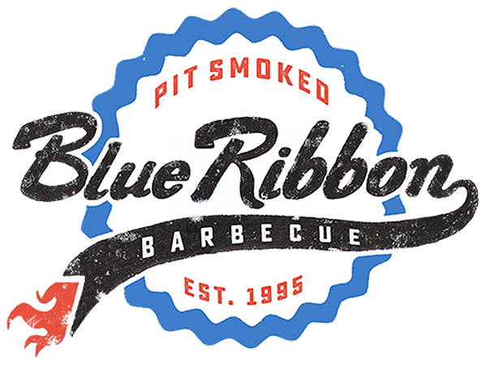

After a lengthy day of strolling through the greater bostonian area with my camera, I developed quite a hankering for red meat.

Specifically, burnt ends a platter, to be more specific. I immediately called my brother. No, delete that. He called me, and we set up a plan. While the wait was longer than I would have anticipated. I was happy to know that the business was doing well.

I left with my food and scurried home, eager to eat it while it was still piping hot.

It was delicious as always.

My main complaint stems from the cornbread and how it was not hot to my standards. However this could have been remedied, should I have chosen to do so by a quick trip to the microwave, mere feet from where I was enjoying my dinner. Alas, I chose not to out of laziness or maybe just out of spite. I'll never know.

Going back to the matter at hand: my dinner. I enjoyed it. 8 out of 10.

