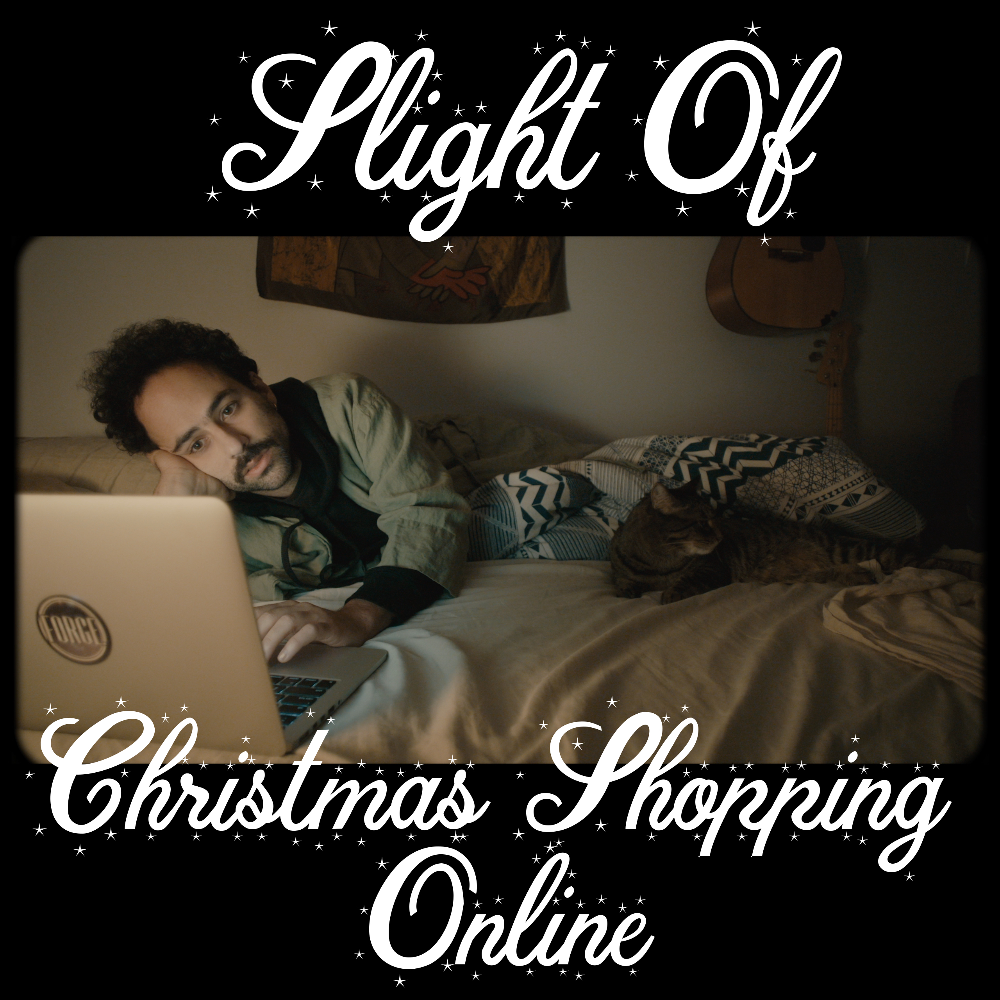

  “Christmas Shopping Online,” is a tender, beautiful, semi-tongue-in-cheek ode to Christmas solitude by Slight Of, the project of singer/songwriter Jim Hill.

The song and accompanying <a href="https://www.youtube.com/watch?v=sTYZrp4dkjc&feature=youtu.be">music video</a>  captures the loneliness that a lot of us are feeling in this strange era, especially around the holidays, and cleverly so. A for-sure highlight of the video is Hill’s portrayal of “Ethel”, an older mom whose kids live halfway around the world, who feeds bread to the stray cats of Ridgewood, Queens.

Hill’s own cat, Steakboy, makes many appearances throughout the video, and in the opinion of this blogger, is a very cute little cat. And yes, that name is a reference to the classic former Brooklyn DIY venue <a href="https://www.youtube.com/watch?v=fz8vTuAPnfM">DBTS</a> (aka David Blaine’s The Steakhouse).

I remember when I first heard <a href="https://slightofband.bandcamp.com/track/door">"Door"</a>, from Slight Of’s 2017 album <i>Life Like</i>. The jangly chords and melody crept into my brain and refused to leave. “Christmas Shopping Online” is already doing the same for me, and it probably will for you too. The track also features light acoustic guitars, auxilary percussion (which the video suggests are actually pots and pans... Is this true??) and a guitar solo that can only be described as sick.

Through the new year, 50% of all Slight Of <a href="https://slightofband.bandcamp.com/track/christmas-shopping-online">bandcamp</a> music and merch sales will be donated to the <a href="https://www.ridgewoodtenantsunion.org/donate/">Ridgewood Tenants Union</a>.

<iframe width="560" height="315" src="https://www.youtube.com/embed/sTYZrp4dkjc" frameborder="0" allow="accelerometer; autoplay; clipboard-write; encrypted-media; gyroscope; picture-in-picture" allowfullscreen></iframe>

