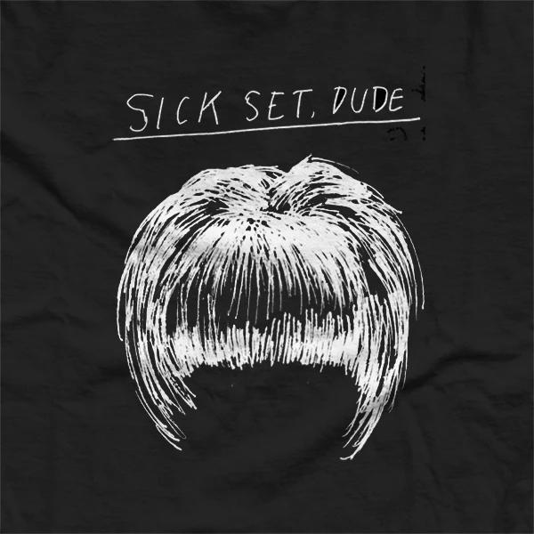
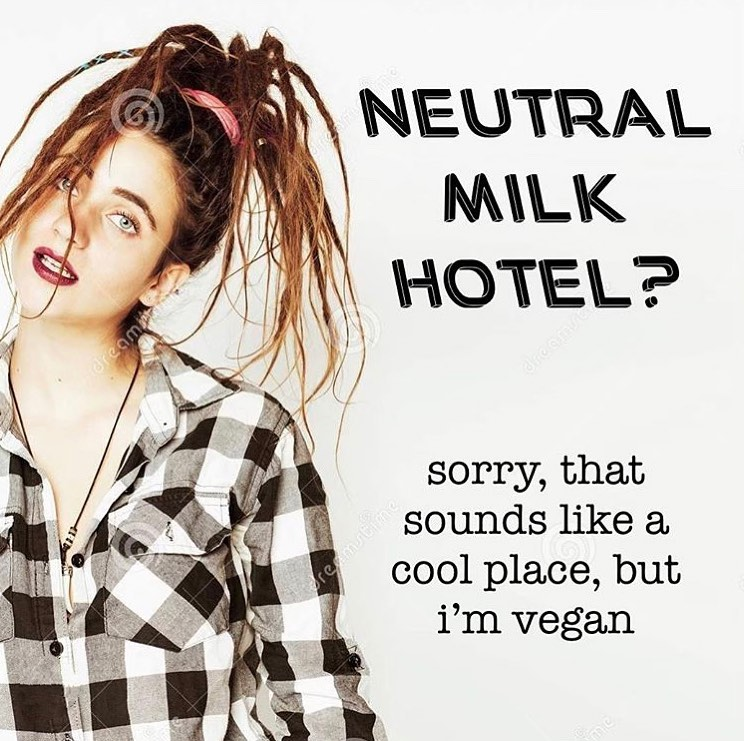

<h4 style="color: black"> <i>...in which alt music memelord Juulsexual sits down with Vom for an exclusive chat</i></h4>

 If you are an active instagram user who has attended at least, say, a few basement shows in the last year, there is a very high chance you’ve seen a meme from the account <a style="color: yellow" href="https://www.instagram.com/juulsexual/">@juulsexual</a>. Since the page’s inception in 2018, it has become a mecca of alternative music commentary and humor, peaking at over 20,000 followers.
The page began as @babysnotallright, cleverly referencing the popular Williamsburg music venue <a style="color: yellow" href="http://babysallright.com/"> Baby’s All Right</a>, eventually changing its name to @Juulsexual. The page has earned the attention of revered indie labels, including <a style="color: yellow" href="http://www.dbldblwhmmy.com/">Double Double Whammy</a>, <a style="color: yellow" href="https://www.explodinginsoundrecords.com/">Exploding in Sound</a> and <a style="color: yellow" href="https://www.polyvinylrecords.com/">Polyvinyl</a>, who will sometimes comment on the posts and reshare content. 

 The content often humorously pulls the rug out from under the sometimes-problematic scene of which it parodies, causing followers to face uncomfortable truths about the DIY bubble, such as: musicians are not ideal daters, label rosters are often not diverse enough, and the hit--“you won’t find love at the gig.”

 A cult-of-personality exists around the page’s lone author, Sarah, whose pixie cut has been immortalized on stickers and shirts. She is exceedingly kind and communicative with her fanbase, who have not always returned the favor in the past; the angry/horny (‘horngry’) men of  indie rock are no strangers to the page, and have often taken advantage of its open DMs to lash out at the content creator. Other followers, however, have been more supportive, buying merch in order to support Sarah’s numerous medical operations and recoveries.

During the summer of 2020, the original Juulsexual page was replatformed and given to <a style="color: yellow" href="https://www.instagram.com/blackgirlcommune/">Black Girl Commune</a>, a Seattle-based collective of black womxn and femmes. The collective is dedicated to educating its community on anti-capitalism and anti-racism, and providing a space for black womxn and femmes.

I virtually sat down with Sarah, the actual real-life person behind the insta. At the time, Sarah was visiting a close friend Ian, drummer of the Albany band <a style="color: yellow" href="https://hateclubalbany.bandcamp.com/"> Hate Club</a>. Together, we discussed her decision to replatform, her life as an educator during the pandemic, and her experience with her sometimes polemical fanbase, amongst other topics and general banter.

<b> Lancelot: So. You are Sarah.</b>

Juulsexual: That’s a great start.

<b> Lancelot: A.k.a. Juulsexual. We go way back. </b>

Juulsexual: We do go way back.

<b> Lancelot: I think we first met two years ago? </b>

Juulsexual: Dude, I thought 2008 was in the decade that we were in today, in conservation with someone, so you could tell me it was 2 years or 20 years ago, and at this point I wouldn’t really have an argument.

<b>L: Yeah, time is super weird right now.</b>

J: It’s just kind of like, it’s passing faster for me lately, but feeling like it’s going by slower in the process, does that make sense?

I think it’s kind of reminiscent, too, of the fact that I have a lot of outside work that I’m supposed to be doing right now, and I’ve let a lot of time slip by where I’m just like ‘oh, where did all those days go” where I wasn’t actively doing any of that work. So like, time’s going by, but during the moment, I have nothing to do with the time anyways. I don’t know where it all went, it just kind of happened. And it happened without me really accomplishing much either.

<b>L: I feel that. There’s a lot of time to do nothing and then it’s just gone, like that.</b>

J: It felt like I was using it really productively for a while this year, because my life outside of the internet specifically, did not stop going. My masters program did not stop and I just became a remote student. My PhD applications still needed to get done, everything that I was doing, like the fact that I was going to be a teacher this year, that didn’t change, it just, if anything, got more scary, because Now, I had to do it in a slightly different way or I had to risk my life to do it.

It was just, I think the sort of paralyzing aspect of that was just realizing that I no longer had spaces to go to to get that work done; It just had to happen on my own time. Now my bedroom is my classroom. And also the place where I try to sleep and where I’m taking half of my meals. Putting that much energy into your home, turning it into your office, and also having phone calls with friends, it’s kind of paralyzing after a while. That’s how all the time goes, you feel like you're stuck in a time warp, where you're almost in a room floating through the twilight zone.

<b>L: You mentioned your life outside of the internet. What is it like having people who only know you through your presence on the internet?</b>

J: It was a lot crazier when the page had like twenty thousand followers, or however many it had when I dipped and did the whole replatforming thing. I feel like not as many people know now that the new page exists. I have my friends still in the picture, and I have really gung-ho followers still in the picture, and then everyone else has just kind of fallen by the wayside, which for the most part would include like-- one of the last bigger events I went to before the world shut down was that Bernie rally that was half rally, half Strokes show. There were a bunch of people up there who DM’d me after the fact and were like ‘I saw you,’ bla bla bla…

<b>L: Oh god…</b>

J: or who like yelled, “Oh my god, that’s Juulsexual!” It’s always nice. It’s always a big, big compliment that people like my content and follow my page don’t get me wrong. But I still do I double take because I identify with the moniker I guess, but in the same moment it’s like, you’re still receiving the bad messages from people, like the death threats and what-not, you’re kind of so in it that it’s hard to recognize the good that people identify in it, or how people might build it up to be a bigger social commentary, or something like that.

I’m just kind of in it making content. And also, getting a certain degree of backlash from scrawny white dudes who clearly only listen to Oneohtrix. And I love Oneohtrix, don’t get me wrong, but I’m just painting a picture here.

<b>L: <a style="color: yellow" href="https://www.youtube.com/watch?v=rUshMsNq2I0"> Oneohtrix</a>, if you’re reading this, please don’t be offended.</b>

J: It’s definitely a type of kid in my DMs who wants to upset me or thinks because the content of the page is humor, that they can, like, take things too far in offending me. There are a lot of people who like what I do, and think that certain things that I’ve said that have circulated have been important in fostering amenable social spaces at gigs and at shows, and even just out about with people who consider themselves “alternative”, or anything of any sort of subcultural awareness. For whatever reason people think that these memes have said some important things and I’m always very flattered by that. There have been a couple of instances where I’ve been recognized in public, and I was nothing but flattered. I think that has to do with the haircut more than anything else.

<b>L: I don’t think that’s the only reason why. It is iconic though…</b>

J: It was a total accident too. I did not want my hair to look like this, but I got in this really, really strange medical circumstance where I had to have this emergency surgery, and post the surgery I started losing a lot of my hair. My hair used to be really really long and then I didn’t have enough hair to substantiate it being that long anymore, cuz It was so thin, so I had to cut it all off and do a pixie for a really long time.I’ve been trying slowly, overtime, as It’s all growing back, to grow out that pixie, and it’s just been a mullet, in every sense of the term, the entire time. So it’s actually a total accident, but ended up being the thing I’m most widely identified for, including my icon, and that t-shirt.

<b>L: Oh yeah, of course.. Who made those?</b>

J: The T-shirts were made by my friend Dave at <a style="color: yellow" href="https://www.emulsionprinthouse.com/">Emulsion Print House,</a> which is based out of Boston. Dave’s in a band called <a style="color: yellow" href="https://helenor.bandcamp.com/">Helenor</a>. They’re really good, really groovy live. I only saw them play live once before the world shut down unfortunately, because Dave and I were kind of late friends. He kind of heard about my medical situation, and knew I needed to raise money for these reparative surgeries over the last month, and he stepped in and was like ‘I would love to offer my print house and my print services to make a t-shirt together, and hopefully make a good chunk of change for it’, and we made enough for me to feel comfortable going into my first operation. It was really really sweet on his part.

<b>L: Have you done other interviews?</b>

J: I’ve only ever done one interview as “juulsexual” or whatever. A kid who followed me was doing a radio show? Basically, he called me while I was on the road with friends of mine, on my way to Portland. They asked me if I actually like the music I talk about, which is cool, that somebody asked me that point blank. Because the honest answer is, if you asked me to name a single Alex G song right now… I think there is one named after me, and that is the only one I’d be able to name. Well… it’s not me specifically, but it has my name.

<b>L: I was about to ask… like “Oh… is <a style="color: yellow" href="https://www.youtube.com/watch?v=wQSxzUvQY7k">‘Sarah’</a> about you? Tell me more.”</b>

J: Yeah that’s a little juicy right? Let’s start that rumor.

<b>L: Yeah I think I might have to lead with that.</b>

J: That would be the Hard Noise headline.

<b>L: That seems like a challenging question, about the music you talk about.</b>

J: Yeah like ‘are you a fake?’ And I am in certain respects. I know that if I sat down and listened to Alex G’s music, I would probably think that it was really good. The problem is that I’ve associated myself with a lot of people who either want to be Alex G, or want to be with Alex G. The hype around a person–it doesn’t get to me to the point where I can’t experience them, but if I ever decided to be an Alex G fan, it would be because I’m experiencing it through the lens of somebody who was close to me. I always want to learn how I can come to love a person or a group, or a piece of music on my own time. I’ll probably get into it in a couple years.

<b>L: There’s no rush, I think. He’s not going anywhere.</b>

J: Yeah, he’ll be playing stadiums for a long time.

<b>L: I’m a big fan, but I totally get that. If there’s a big cult of personality for an artist, it can totally be a turnoff.</b>

J: Here’s the thing, I did that with <a style="color: yellow" href="https://www.youtube.com/watch?v=p9JIIP5ZkIU">Girlpool</a> for a really long time. It took me a really long time to actively listen to Girlpool, and I love them. I really do, but I entered college, and the first four or five people that I really got close with were so so obsessed that it just felt that it was kind of untouchable for me, because I didn’t come in obsessed with the thing.

<i> At this point Sarah told me about a band called <a style="color: yellow" href="https://www.youtube.com/watch?v=R_3u7aspmDY">Mew</a>, and I thought she was saying Neu, and when I went to google it, Northeastern University came up, which was very confusing. </i>

J: I have so many associations with songs from that band. I don’t know if you’ve ever heard a band do something with a chord progression or a vocal progression that sticks in your mind as really emotionally impactful, but they do that in almost every song.

<b>L: Nah, I hate music but that sounds cool...</b>

J: All music sucks. I replied to someone’s tweet last night, Eric from Heart Attack Man, I said “only hot people are allowed to make music and only ugly people are allowed to like it.”

<b>L: That’s a good quote. That should just be the whole interview, just that one quote.</b>

J: That would be really on brand.

<b>L: It’s too on brand. I think we’ve gotta show the people more.</b>

J: Yeah, how can we widen the scope? What’s a side of me that people haven’t seen? That’s the other upsetting thing. Unfortunately, through my page people have seen a lot about my personal life. I’m a bit of an open book.

<b>L: Yeah, well, I think it’s refreshing. Is it not always refreshing for you?<b>

J: It’s been really nice, especially in the instances in which people have come out in support of my medical struggles. Those things have really plagued me. I have a really good support system at home, and through friends. I have a good community around me and everything, but just understanding that there are strangers out there who cared enough to support me verbally, or even monetarily in small ways, it really humbled me. It blew my mind, and it wouldn't have been possible if I weren’t comfortable being vulnerable, I guess. People seem to like not only the content, but also interacting with me, and replying to my stories when I’m kind of just doing my daily stuff.

<b>L:  How do you feel about teaching this upcoming year?</b>

J: It’s a really scary time to be a teacher. I’m really scared that schools are going to make the transition to in-person learning when it clearly wouldn’t make any sense to do that, and that I’m gonna suffer for it and my kids are going to suffer for it. If anything, it will negatively affect learning more than being remotely online would, because people are just going to be scared for their health, and not retaining any information.

<b>L: How do you and Ian know each other? </b>

J: We followed each other for a long time. I love Hate Club, I like Noah, and knew Noah. Ian and I connected over the last couple weeks or so. I was going through a very tumultuous mental period, and I needed people to talk to, who were really good at listening, and Ian and I just kind of hit it off. He’s really good at doing the thing where he recognizes you need to hear a certain thing, and can identify when it's the appropriate time to say the thing. That’s always good for someone going through a breakup.

I decided to make the trip up. I made the trip up for the day to really drill out some work, listen to music and eat vegan snickerdoodles that his mom made.

The thing is, I love working. I’ve just been having a really hard time redirecting my energy lately, and self motivating. It feels good to do that again because it makes me feel more like myself. When I feel I’ve accomplished something, it’s a retroactive enjoyment. You don’t enjoy it in the process, but for having done it, you feel more rounded and confident as a human being. That’s the feeling I’ve been chasing through years of academia. Unfortunately, when I hit slumps, it eludes me, but it feels good to be back in it, focusing and getting to the nitty gritty.

<i> Editors note: At this point, Sarah and Ian consider going to Rochester to visit some friends. </i>

J: I’ve gotta get up there to visit my friends in <a style="color: yellow" href="https://fullbody.bandcamp.com/">Full Body</a>, that I haven’t seen in a long time.They’re really good. I accidentally ended up at the <a style="color: yellow" href="https://www.youtube.com/watch?v=GhHwuPNA-j4">Jesus Lizard</a> New Year’s show with them in New York, and I didn’t know they were gonna be there and it was the last time I saw them. It was a weird sort of constellation of a bunch of people that I knew, and part of that was the entire band Full Body.

<b>L: I miss that, going to shows and even if it’s not crowded, having a bunch of random people that you kind of know from different places there.</b>

J: Yeah, I even really miss the people that you distantly know, like people that you know through another person. And you’re like, ‘oh that’s so-and-so, I’ve never talked to them, but here we are, inhabiting the same room together.’ I kind of miss some of the B-tier people more than I miss some of the A-tier people.

<b>L: Hahaha, should I include that? Will the A-tier people be upset?</b>

J: Go for it, the A-tier people know who they are and know that I love them.

<b>L: Do you think the flaws in your fanbase are the same flaws as the music scene in general?</b>

J: Absolutely, and they’re the same flaws in me, and the people in the fanbase who are less shitty unfortunately. Something that I’ve found outside of this whole page, and through classes about becoming an educator, is reconstructive work. It also means learning about implicit biases and other things you bring into social context with you just based off of who you are and how you assume your identity, and how you experience other people’s identities.

In alternative scene settings, for lack of a better way of putting it, the assumption is that people are better at leaving their implicit biases at the door, because these are people used to feeling a bit socially outcast; what I’ve found, unfortunately, is that it’s a 50/50 split of people caring more about implicit biases and people caring less about their implicit biases because they feel socially outcast. There’s a lot of work yet to be done, that I also am daily actively doing to just understand that I live in a social context where it’s my responsibility to process people in the way that they want and deserve to be processed, and to respect the people around me. As individual human beings, we have a hard time seeing past our own eyes in certain circumstances.

I’m a white woman, and I know my experience of certain spaces is incredibly limited. Any of the work that I need to do to understand how to be a better person in social context will have a lot to do with listening to other people who know what that work is and what needs to be done. A lot of this work hinges upon people’s propensity to listen, and more often than not I’ve found that people in the scene really like to speak into the void about things, rather than listen to the void speaking back to them.

<b>L: What does that mean, the void speaking back to them?</b>

J: Being able to just read the room. There are still more all-white rosters and labels than there are rosters that have even a single person of color on them. There are all-white labels parading around, deciding this is the face of music, and this that and the other thing, because we ascribe a certain degree of power to them. There are so many people reply tweeting and quote tweeting (labels) like this and saying ‘hey, maybe you should wise up to the fact that this isn’t representative of music, or what’s out there.” This isn’t even representative of the bulk of what people enjoy, you know? It just kind of feels like we ascribe relative power to certain institutions within this broader institution of music, and they just kind of get to proclaim and profess for us what the next thing is that we need to be listening to, and more often than not, it assumes an identity that looks a lot like theirs.

<b>L: Are you also referring to publications, or maybe… spotify?</b>

J: Publications, labels, obviously Spotify hasn’t been listening to any of the backlash they’ve been receiving. That’s the thing, when it’s a top-down type situation, a lot of people who feel like they have relative power are just kind of professing the next big thing, and then everyone else is like “woah, wait a second, we are much more diverse than that and creating much more diversely.’ I don’t really feel like any of this stuff gets the time of day with super-structures that are currently in place, for music with a capital M. Big Business Music. Basically, if I were to summarize that in a better sound bite, I’d say that people and groups would benefit from listening a little more and speaking a little less.

<b>L: That’s a great soundbite, but I feel like the entire quote is necessary.</b>

J: I think I’ve rambled but feel free to use some of it.

<b>L: Can you talk about your decision to deplatform? What was that like, giving your platform to someone else? And what led to you doing that?</b>

J: I knew it was gonna happen from the jump. I looked at my page and it had a pretty significant number of followers, and I had heard of replatforming from a couple of meme pages who kind of existed in the same context as my page. They hadn’t decided to replatform but conversations started happening like “we know some POC content creators that would be interested in taking over your pages, and would anyone be interested in doing that.”

I’d kind of gotten to the point with the page where I could just take it or leave it, because it was just generating a lot of negativity for me. I thought that the only real way for me to remove that negative energy was to replatform, so I gave the page to Black content creators. Black Girl Commune already had a page with five or six thousand followers, so they kept that page too. Then, once the two week metric went by, they changed the name of the page from @juulsexual to @blackgirlcommune.

The decision was easy. I wasn’t sure if I’d be able to use the “juulsexual” @ again, and I was ready at that point to just not ever see it again. I was just feeling the weight of the world around me, and the necessity of it.

<b>L: Is there any music that you want to plug?</b>

J: Definitely Hate Club,  Dolly Spartans, (Michael has been an incredible friend and resource as of late. They had a song on Guitar Hero I think.) Full Body, shouts out Rochester crew. <a style="color: yellow" href="https://www.youtube.com/watch?v=HdQ2L4Yiaqs">Ghost Piss</a>.. <a style="color: yellow" href="https://deadtoothbk.bandcamp.com/">Dead Tooth</a>. <a style="color: yellow" href="https://saintseanhenry.bandcamp.com/album/a-jump-from-the-high-dive">Sean Henry</a> has been really supportive of me. Steve Hartlett.. I love him and if he decides to do anything else or decides not to. My friend Boner from Ovlov is starting a band called <a style="color: yellow" href="https://sinceraband.bandcamp.com/album/high-cuts-hidden-corners">Sincera</a> with a couple of other New Haven Locals, so you know, check out their stuff-- if it exists.

<b>L: How do you know all the good musicians? You know everyone it seems like.</b>

J: I just got really lucky. I went to a lot of shows in CT growing up, at Woodbury’s Town Hall and Newtown Teen Center, and at The Space, (when it was just The Space, and no Ballroom). I made the rounds. I made a lot of good friends later in life after having gone to their shows for a really long time.

<b>L: This blog is called Vom Blog. How do you feel about vom?</b>

J: Meaning what?

<b>L: Take that however you want to.</b>

J: I like the conception of it as something where you can just kind of spew you felt was pertinent to spew. That’s the first thing that comes to mind. But if you’re asking me if I’m a fan of throwing up, it depends if you have food in your stomach or not. I do have some negative associations, but we’ve also all gotten a little too fucked up.

<b>L: Gotcha. A well-rounded answer. Do you think you will stay in the Northeast for a while? </b>

J: Everybody’s making the flight to California. I’m getting everybody on board. I got Ian on board cuz we’re both thinking about UCLA... Jack from Full Body too. My friend Ryan, from New York, is considering switching from doing NYC film stuff to LA movie stuff and music videos. And I’m like yes, let’s all sail across the country.

<b>L: Woah, that’s a good idea, yeah! Get a boat, and take the rivers there! I think some of them flow in the right direction.</b>

J: We’d save a ton on gas.

<b>L: It might be tough because of the continental divide, sailing-wise, but if you have a motorboat it might work.</b>

J: I’d like to steer clear of motorboats, because I’d like to save on gas. So I’m thinking big sailing ship–one of the tall ships.

<b>L: Like the USS Constitution?</b>

J: Yeah. We’re gonna take the USS Constitution to LA.

<b>L: This sounds like the next <i> National Treasure.</i> </b>

J: Imagine us trying to navigate the Los Angeles river system. I think it’s just a trickle of water on a bed of concrete. We’re all gonna move to California and take it over, and live in a nice, happy apartment together.

