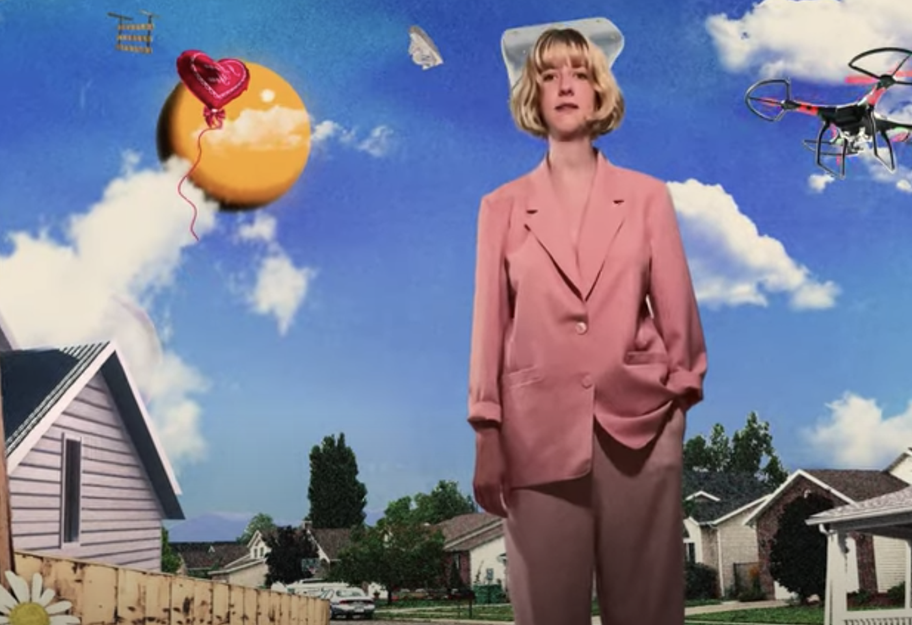

 
 

 Hello freaks. God damn, Slow Pulp is a really really good band. This week, the group released an ethereal power-sad ballad, “Falling Apart”, off of their upcoming album “Moveys”. The track came accompanied by an <a href="https://www.youtube.com/watch?v=yuoFLLHB1Fc">incredible music video</a>; I love when the really good bands do that. 
 

 Key to this track are the beautiful violin parts played by Molly Germer, a frequent Alex G collaborator, which add an elegant depth to the arrangement. Emily Massey’s contemplative vocals float along, peeking its head just above the surface for a look around. 
 

“Why don’t you go back/to falling apart,/you were so good at that”, she laments in the chorus, perhaps narrating a depressive internal monologue. The lyrics also mention “feeling like a deadbeat”, needing to “step up”, and the struggle to be enough, which further suggest that the song is more a message directed towards oneself as opposed to an external subject.  

 This lyrical theme, along with the dreamy arrangement, give the listener a sense of just floating through it all, not really in control of where they’re going. As if we were all stuck in a pandemic or something like that.
 

As I mentioned earlier, Slow Pulp decided to release this single with its music video simultaneously, and in the opinion of this amateur music journalist, it paid off bigtime. 

The film’s moving-collage animation brings a fever-dream twist to the early days of MTV’s music video catalogue. The viewer gets that same sense of floating or levitating through, a la Jeff Bridges in that classic Big Lebowski bowling dream sequence, featuring Kenny Rogers’ “I Just Dropped In (To See What Condition… etc.)”

In one of my favorite sequences, the sun doubles as a yellow ball on a chain that swings in between Massey and the viewer’s face, as the sky quickly rises in the background like a sheet of paper. The producers, Powered By Wind, were keen to blend real and animated textures together into this trippy, engaging tapestry.

In a poignant scene, Massey searches for the final piece of a jigsaw puzzle, in a warbly house. Also, how did the animators get that shot of the puzzle piece from that underneath perspective? Powered By Wind, feel free to email me. I am so curious. 

Based on what we’ve heard so far, this Slow Pulp album is as highly anticipated as anything the group has put out before. I preordered the <a href="https://slowpulp.bandcamp.com/album/moveys">cassette</a> so fast, and so should you. 

 
	

